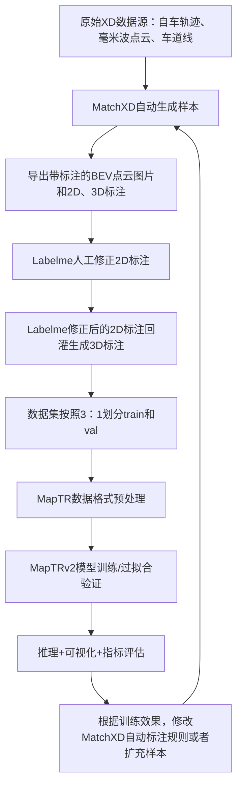

# MapTRv2 毫米波道路边界提取工程说明
## 1. 项目概述

本项目用XD毫米波数据制作数据集，使用MapTRv2提取道路边界折线。文档**以数据生产闭环为核心主线**，覆盖「**原始数据→自动样本生成→人工标注修正→数据格式转换→模型训练→推理可视化/结果分析**」全链路。

### 1.1 项目目标
复用MapTRv2矢量地图解码器架构，搭建XD毫米波点云BEV→道路边界矢量折线提取链路。
- **输入**：毫米波雷达多帧点云、3D车道线、车辆自车轨迹、道路边界3D标注真值
- 输出：道路边界矢量折线（有序坐标点集）、可视化BEV对比图、评估指标日志
### 1.2 完整闭环总流程


## 2. 数据标注流程
针对XD数据的标注流水线分为**自动样本生成、人工标注修正与更新**两个阶段。
### 2.1 阶段一：MatchXD 自动样本生成
### 2.1.1 MatchXD运行

```
代码编译： build.sh

代码运行：run_jni_xd_all.sh

样本生成核心代码： maptr_sample_exporter.cc
```

#### 2.1.2 输出目录结构（单样本）

```
sample_xxxx/
├── raster.png        # 毫米波投影BEV灰度图（输入）
├── raster.json       # 存放的2d坐标，和raster.png配套用于labelme读取
├── raster_with_boundary.png  # 自动生成粗边界叠加图（校验用）
└── sample.json      # MatchXD自动生成粗标注json，有2d,3d坐标
```
#### 2.1.3 自动生成与人工检查
```
MatchXD工程
1. 自动生成：根据自车位姿裁剪局部地图，将雷达点云、自车轨迹、车道线投影至BEV栅格，并将Match中已经生成好的道路边界折线存为标注；
2. 人工检查：缺失（延长或删掉重新画）、冗余（删掉）、错乱（删掉重新画）均为异常样本
   
- 如果是原型快速验证，可以把异常的样本都删掉，只保留好的样本，按照如下步骤：   
① 执行脚本make_maptr_preview.bat，修改bat中的路径配置，为样本生成预览。
② 从预览中删除不要的样本
③ 执行delete_bad_maptr_samples.bat，依据预览的删除，从原样本路径中删除废弃样本

- 原型验证OK以后，需要扩充样本量，异常样本就要用labelme进行修正
```
### 2.2 阶段二：Labelme 人工标注修正与更新

#### 2.2.1 Labelme环境安装
```bash
conda create -n labelme python=3.8
conda activate labelme
pip install pyqt5 labelme -i https://pypi.tuna.tsinghua.edu.cn/simple
labelme  # 启动标注界面
```
#### 2.2.2 修正后的样本3d标注回灌
```
MatchXD中修改bat中配置的路径，再运行backfill_sample.bat
就把labelme修改的2d坐标结合投影时sample.json的范围把道路边界的3d坐标也修改了
```
#### 2.2.3 样本划分为train和val
```
使用MatchXD中的脚本split_maptr_samples.bat
```

## 3. MapTR 模型训练
### 3.1 工程基础环境配置
- 服务器地址：10.130.21.244，工作根目录：`/data/huinian/source/MapTR`
- GPU：RTX 2080Ti 11G，驱动535.230.02
- Conda环境：`py38`
```bash
# 进入环境固定脚本
conda activate py38
cd /data/huinian/source/MapTR
export PYTHONPATH="/data/huinian/source/MapTR:$PYTHONPATH"
```
### 3.2 模型训练流程
#### 3.2.1 数据格式预处理
```bash
# XD train样本预处理
python tools/maptrv2/build_xd_maptr_infos.py \
  --sample-root /data/huinian/data/MapTR/sample-0717 \
  --split-file /data/huinian/data/MapTR/sample-0717/train.txt \
  --out-dir work_dirs/xd_maptr_samples_train \
  --pc-range 0 -40 100 40

# XD val样本预处理
python tools/maptrv2/build_xd_maptr_infos.py \
  --sample-root /data/huinian/data/MapTR/sample-0717 \
  --split-file /data/huinian/data/MapTR/sample-0717/val.txt \
  --out-dir work_dirs/xd_maptr_samples_val \
  --pc-range 0 -40 100 40
```

```bash
# XD样本完整性校验（排查标注格式错误）
python tools/maptrv2/check_xd_maptr_infos.py \
--pkl work_dirs/xd_maptr_samples_train/maptr_raster_infos.pkl
```
#### 3.2.2 训练启动命令
```bash
bash tools/dist_train.sh \
  projects/configs/maptrv2/maptrv2_xd_raster_boundary.py \
  1
```
#### 3.2.3 训练输出产物（work_dirs内）
- 权重：`latest.pth`、`epoch_6/12/24/48.pth`；
- 日志：`*.log`、`*.log.json`（loss曲线数据源）；
- loss可视化绘图命令
```bash
python tools/analysis_tools/analyze_logs.py plot_curve \
  work_dirs/maptrv2_xd_raster_boundary/*.log.json \
  --keys loss \
  --legend loss \
  --out work_dirs/maptrv2_xd_raster_boundary/loss_total_curve.png

python tools/analysis_tools/analyze_logs.py plot_curve \
  work_dirs/maptrv2_xd_raster_boundary/*.log.json \
  --keys loss_pts loss_dir loss_cls \
  --legend loss_pts loss_dir loss_cls \
  --out work_dirs/maptrv2_xd_raster_boundary/loss_final_curve.png
```

### 3.3 推理、可视化与结果分析
#### 3.4.1 可视化核心脚本`vis_pred.py`
功能：加载模型权重，推理生成预测边界折线，叠加BEV输入与GT真值对比图；支持设置置信度阈值过滤低质量预测。
#### 3.4.2 执行示例
```bash
python -u tools/maptr/vis_pred.py \
  projects/configs/maptrv2/maptrv2_xd_raster_boundary.py \
  work_dirs/maptrv2_xd_raster_boundary/epoch_90.pth \
  --show-dir work_dirs/maptrv2_xd_raster_boundary/vis \
  --score-thresh 0.2 \
  --max-samples 2

python -u tools/maptr/vis_pred.py \
  projects/configs/maptrv2/maptrv2_xd_raster_boundary.py \
  work_dirs/maptrv2_xd_raster_boundary/epoch_90.pth \
  --show-dir work_dirs/maptrv2_xd_raster_boundary/vis_train \
  --score-thresh 0.2 \
  --max-samples 32
```

推理的结果：
```

```
同时在vis_train/vis_eval 目录下生成，在QGIS中可以可视化
```
all_gt_wgs84.csv
all_pred_wgs84.csv
```

```